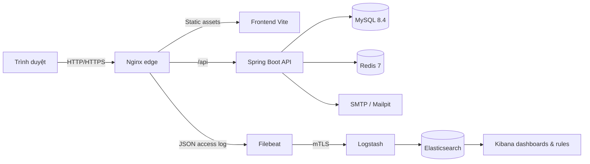

# Flare Fitness

Flare Fitness là hệ thống thương mại điện tử dành cho sản phẩm thể thao, được
xây dựng trong khuôn khổ PBL4. Repository không chỉ chứa ứng dụng bán hàng mà
còn tập trung vào ba mục tiêu kỹ thuật:

1. Xây dựng đầy đủ luồng nghiệp vụ khách hàng, nhân viên và quản trị viên.
2. Bảo vệ ứng dụng từ trình duyệt, reverse proxy, API đến dữ liệu và secret.
3. Thu thập, phân tích và trực quan hóa Nginx access log bằng Elastic Stack.

Ứng dụng có thể chạy độc lập bằng Docker Compose. Nginx phục vụ frontend Vite
đã build và reverse proxy `/api` đến Spring Boot; backend sử dụng MySQL cho dữ
liệu nghiệp vụ và Redis cho token, OTP, rate limit cùng trạng thái ngắn hạn.

## Mục lục

- [Dự án đang làm gì?](#dự-án-đang-làm-gì)
- [Chức năng chính](#chức-năng-chính)
- [Kiến trúc hệ thống](#kiến-trúc-hệ-thống)
- [Công nghệ sử dụng](#công-nghệ-sử-dụng)
- [Cấu trúc repository](#cấu-trúc-repository)
- [Chạy nhanh bằng Docker](#chạy-nhanh-bằng-docker)
- [Các chế độ chạy](#các-chế-độ-chạy)
- [Phát triển frontend](#phát-triển-frontend)
- [Kiểm thử](#kiểm-thử)
- [Observability và Elastic Stack](#observability-và-elastic-stack)
- [Bảo mật](#bảo-mật)
- [Database và Redis](#database-và-redis)
- [CI/CD](#cicd)
- [AWS lab](#aws-lab)
- [Tài liệu](#tài-liệu)
- [Giới hạn hiện tại](#giới-hạn-hiện-tại)

## Dự án đang làm gì?

Flare Fitness mô phỏng một hệ thống bán hàng thực tế thay vì chỉ trình diễn giao
diện. Một request từ trình duyệt phải đi qua Nginx, lớp xác thực/phân quyền của
Spring Security, service nghiệp vụ, MySQL hoặc Redis; access log sau đó có thể
được chuyển qua Filebeat và Logstash để phân tích trong Elasticsearch/Kibana.

Các phần đang được triển khai và kiểm chứng trong repository gồm:

- Website mua sắm sản phẩm thể thao cho khách hàng.
- API quản lý sản phẩm, tài khoản, đơn hàng, đánh giá, voucher và hỗ trợ.
- Xác thực JWT qua cookie, CSRF, OTP email và phân quyền theo vai trò.
- Flyway migration làm nguồn duy nhất cho cấu trúc database.
- Docker Compose cho local development, integration test và E2E.
- Nginx hardening, trusted proxy policy và security headers.
- Pipeline Nginx → Filebeat → Logstash → Elasticsearch → Kibana.
- GeoIP, dashboard, detection rule, disk queue và persistent queue.
- Terraform và cloud-init cho mô hình Web EC2 + Monitor EC2 trên AWS.
- CI kiểm tra test, coverage, dependency, container, IaC và supply chain.

## Chức năng chính

### Khách hàng

- Xem, tìm kiếm, lọc và sắp xếp sản phẩm.
- Đăng ký, đăng nhập, đăng xuất và đăng xuất khỏi mọi thiết bị.
- Xác minh OTP khi đăng ký hoặc đặt lại mật khẩu.
- Xem và cập nhật hồ sơ, email, mật khẩu.
- Tạo đơn hàng, xem lịch sử, gửi yêu cầu hủy hoặc đổi trả.
- Đánh giá sản phẩm đã mua.
- Nhận, áp dụng và theo dõi voucher.
- Tham gia chiến dịch promo hunt và nhận ưu đãi.
- Gửi/nhận tin nhắn hỗ trợ.
- Nhận gợi ý sản phẩm dựa trên dữ liệu hành vi được phép thu thập.

### Nhân viên và quản trị viên

- Quản lý danh mục sản phẩm và biến thể sản phẩm.
- Theo dõi và cập nhật trạng thái đơn hàng.
- Kiểm duyệt đánh giá sản phẩm.
- Quản lý voucher và việc gán voucher cho người dùng.
- Xử lý hội thoại hỗ trợ khách hàng.
- Xem dữ liệu analytics tổng hợp.
- Quản trị viên có thêm quyền quản lý tài khoản và chiến dịch promo hunt.

### Vận hành và giám sát

- Health check cho Nginx, backend, MySQL, Redis và Elastic Stack.
- Nginx ghi access log JSON có request/trace ID.
- Filebeat gửi log qua mTLS và có disk queue.
- Logstash parse, chuẩn hóa, redaction và GeoIP enrichment.
- Elasticsearch áp dụng data stream, mapping và retention policy.
- Kibana cung cấp ba dashboard và sáu detection rule trong local lab.
- Bài kiểm tra recovery xác nhận queue và dữ liệu tồn tại sau outage/restart.

## Kiến trúc hệ thống



Luồng chính:

1. Nginx là HTTP entry point duy nhất; container backend không publish cổng ra
   ngoài trong base Compose.
2. Frontend và API dùng cùng origin để cookie xác thực và CSRF hoạt động đúng.
3. Spring Boot kiểm tra xác thực/phân quyền trước khi gọi service và repository.
4. Flyway cập nhật schema trước khi ứng dụng nhận traffic.
5. Khi bật profile observability, access log được chuyển qua pipeline Elastic
   mà không cần publish Elasticsearch hoặc Logstash ra host.

## Công nghệ sử dụng

| Lớp | Công nghệ | Vai trò |
| --- | --- | --- |
| Frontend | Vite 6, HTML, CSS, JavaScript ES modules | Giao diện người dùng và admin |
| Edge | Nginx stable Alpine | Static hosting, reverse proxy, header và access log |
| Backend | Java 21, Spring Boot 3.5 | REST API và nghiệp vụ |
| Security | Spring Security, JWT, BCrypt-SHA256, CSRF | Xác thực và phân quyền |
| Database | MySQL 8.4, Spring Data JPA, Flyway | Dữ liệu nghiệp vụ và migration |
| Cache/state | Redis 7 | Token, OTP, rate limit và state ngắn hạn |
| Email | Spring Mail, SMTP, Mailpit | OTP thật hoặc email E2E cô lập |
| Test | JUnit, Testcontainers, Vitest, Playwright | Unit, integration, coverage và E2E |
| Observability | Filebeat, Logstash, Elasticsearch, Kibana 9.4 | Log pipeline, dashboard và alert |
| Infrastructure | Docker Compose, Terraform, cloud-init | Local runtime và AWS lab |
| CI/security | GitHub Actions, OWASP Dependency-Check, Trivy, SBOM | Quality gate và supply-chain checks |

Các image runtime và GitHub Action quan trọng được pin bằng immutable digest để
giảm rủi ro thay đổi ngoài ý muốn.

## Cấu trúc repository

```text
.
├── backend/                    Spring Boot API, test và Flyway migration
├── frontend/                   Vite frontend, Vitest và Playwright
├── nginx/                      Nginx image, proxy và security headers
├── observability/              Elastic Stack, PKI, dashboard, rule và runbook
├── terraform/                  AWS network, EC2, EBS và cloud-init templates
├── scripts/                    Regression và Compose hardening checks
├── docs/                       ERD, phân tích thuật toán và evidence
├── docker-compose.yml          Stack nền tảng
├── docker-compose.dev.yml      Development fixture profile
├── docker-compose.e2e.yml      E2E fixture và Mailpit
├── PLAN_AWS_ELK.md             Kế hoạch triển khai AWS–ELK
└── .github/workflows/          CI và full observability runtime workflow
```

`db-init/` chỉ còn là dữ liệu legacy/tham khảo. Base Compose không mount hoặc
chạy MySQL init script trong thư mục này; Flyway là nguồn schema duy nhất.

## Chạy nhanh bằng Docker

### Yêu cầu

- Git.
- Docker Engine hoặc Docker Desktop có Compose v2.
- Khoảng 4 GB RAM trống cho application stack cơ bản.
- Port `80` và `3307` đang trống, hoặc đổi `HTTP_HOST_PORT`/port development
  tương ứng.

### Khởi động development stack

```bash
git clone https://github.com/VoThanhQuan-Pentest/PBL4.git
cd PBL4
cp .env.example .env

# Chỉnh credential local và APP_MAIL_* nếu muốn thử luồng OTP qua SMTP.
docker compose -f docker-compose.yml -f docker-compose.dev.yml up -d --build
docker compose -f docker-compose.yml -f docker-compose.dev.yml ps
```

Khi các health check đã thành công:

- Website: `http://localhost`
- API health: `http://localhost/api/health`
- MySQL, chỉ bind loopback: `127.0.0.1:3307`

Dừng stack nhưng giữ database, Redis và log volume:

```bash
docker compose -f docker-compose.yml -f docker-compose.dev.yml down
```

Không thêm `--volumes` nếu muốn giữ dữ liệu development.

### Tài khoản demo development

`docker-compose.dev.yml` bật Spring profile `dev`. Repeatable Flyway fixture tạo:

| Vai trò | Tài khoản | Mật khẩu |
| --- | --- | --- |
| Quản trị viên | `dev_admin` | `DevAdmin#2026!` |
| Khách hàng | `dev_customer` | `DevCustomer#2026!` |

Các tài khoản này chỉ dành cho local development. Base Compose không bật fixture
và không tự tạo tài khoản, PII, đơn hàng hay sản phẩm demo.

## Các chế độ chạy

| Chế độ | Compose files/profile | Mục đích |
| --- | --- | --- |
| Base | `docker-compose.yml` | Production-like app stack, không có fixture |
| Development | Base + `docker-compose.dev.yml` | Dữ liệu và tài khoản demo repeatable |
| E2E | Base + `docker-compose.e2e.yml` | Mailpit, fixture cô lập và Playwright |
| Local ELK | Base + E2E + monitor + local overrides | Pipeline observability đầy đủ |
| AWS Web | Base + `observability/docker-compose.web-aws.yml` | Web EC2, bind-mounted logs/Filebeat data |
| AWS Monitor | `observability/docker-compose.monitor.yml` | Elasticsearch, Logstash và Kibana |

Nên đặt Compose project name riêng khi chạy test song song để container, network
và volume không đụng nhau.

## Phát triển frontend

Yêu cầu Node.js 22 và backend đang chạy ở port `8080`, hoặc đặt
`VITE_API_PROXY_TARGET` đến backend phù hợp.

```bash
cd frontend
npm ci
npm run dev
```

Vite proxy `/api` đến backend, vì vậy frontend vẫn kiểm thử cookie và CSRF trong
cùng origin. Production bundle được build trong `nginx/Dockerfile` bằng lockfile.

Các lệnh hữu ích:

```bash
npm run test
npm run test:coverage
npm run build
npm run assets:verify
```

`assets:optimize` chuyển JPG/JPEG/PNG sang WebP và giới hạn mỗi file 500 KB;
`assets:migrate` cập nhật các tham chiếu frontend và seed SQL liên quan.

## Kiểm thử

### Backend unit và integration test

Backend integration test dùng Testcontainers với MySQL và Redis thật. Docker
daemon phải hoạt động; không bỏ integration test chỉ để có kết quả xanh.

```bash
cd backend
mvn -B -ntp verify
```

Lệnh `verify` chạy test, tạo JaCoCo report và áp dụng coverage gate đã khai báo
trong `backend/pom.xml`.

### Frontend unit, coverage và build

```bash
cd frontend
npm ci
npm run test
npm run test:coverage
npm run build
npm audit --audit-level=high
npm audit --omit=dev --audit-level=high
```

Không chạy `npm audit fix` tự động vì dependency upgrade cần được review và kiểm
thử riêng.

### Playwright E2E

```bash
docker compose -p flare-e2e --env-file .env.e2e.example \
  -f docker-compose.yml -f docker-compose.e2e.yml up -d --build

cd frontend
npm ci
npx playwright install --with-deps chromium
E2E_BASE_URL=http://127.0.0.1:8088 npm run test:e2e

cd ..
docker compose -p flare-e2e --env-file .env.e2e.example \
  -f docker-compose.yml -f docker-compose.e2e.yml \
  down --volumes --remove-orphans
```

Mailpit được publish ở `127.0.0.1:8025` trong E2E stack. Video Playwright tắt
mặc định để không phụ thuộc FFmpeg; đặt `PLAYWRIGHT_VIDEO=1` khi môi trường đã có
browser/FFmpeg phù hợp.

### Nginx, Compose và runtime regressions

```bash
sh nginx/test-hardening.sh
sh scripts/verify-compose-hardening.sh
scripts/verify-docker-runtime-regressions.sh
scripts/verify-redis-volume-migration.sh
```

Hai regression script Docker tự tạo project name cô lập và chỉ dọn tài nguyên
do chính bài test đó tạo ra.

## Observability và Elastic Stack

Local ELK lab yêu cầu Docker Compose 2.35+, `bash`, `curl`, `jq`, `openssl`,
x86_64, Internet để tải pinned image/GeoIP database và khoảng 16 GB RAM.

```bash
observability/scripts/local-lab.sh bootstrap
observability/scripts/local-lab.sh validate
observability/scripts/local-lab.sh up
observability/scripts/local-lab.sh verify
observability/scripts/local-lab.sh evidence
```

Endpoint mặc định:

- Web: `http://127.0.0.1:8088`
- Kibana: `http://127.0.0.1:5601`

Nếu port đang được sử dụng, đặt `LOCAL_LAB_WEB_PORT` hoặc
`LOCAL_LAB_KIBANA_PORT`; không cần dừng dịch vụ khác trên máy.

Dừng và giữ dữ liệu/queue:

```bash
observability/scripts/local-lab.sh down
```

Xóa toàn bộ local lab chỉ khi chủ động xác nhận:

```bash
LOCAL_LAB_PURGE_CONFIRM=yes observability/scripts/local-lab.sh purge
```

Pipeline kiểm tra mapping, lifecycle, redaction, parse error, deduplication,
GeoIP, detection alert, analyst role, queue recovery, logrotate continuity và
khả năng giữ dữ liệu sau restart. Chi tiết vận hành nằm trong
[observability/README.md](observability/README.md).

## Bảo mật

Các lớp bảo vệ chính của project:

- JWT được gửi bằng cookie `HttpOnly`, `SameSite=Strict`; production bắt buộc
  cookie `Secure`.
- CSRF dùng cookie/token riêng và được kiểm tra cho request thay đổi trạng thái.
- Mật khẩu được mã hóa bằng BCrypt-SHA256 cost 12.
- JWT/token state lưu trong Redis dưới dạng fingerprint phù hợp thay vì coi
  browser token là session server truyền thống.
- `ADMIN`, `STAFF`, `CUSTOMER` có quyền API tách biệt.
- CORS production chỉ chấp nhận origin HTTPS cụ thể, không wildcard với cookie.
- Nginx không tin `X-Forwarded-*` từ client; chỉ tin CIDR của TLS terminator ngay
  trước nó khi được cấu hình rõ.
- Backend chạy non-root, read-only filesystem và không có Linux capability.
- MySQL chỉ publish loopback trong development; Elasticsearch và Logstash không
  publish ra host trong local ELK.
- Filebeat → Logstash dùng mTLS; secret/keystore nằm ngoài Git.
- Access log không ghi body, cookie, Authorization, JWT hoặc CSRF token; query
  value được redaction trước khi ingest.
- Production profile fail-fast khi phát hiện JWT, cookie, CORS, datasource,
  Redis, SMTP hoặc trusted-proxy configuration không an toàn.

Không commit `.env`, private key, password, keystore, Terraform state hoặc nội
dung `.secrets/`. `.env.example` chỉ là template development và chứa placeholder
cố ý bị production validator từ chối.

## OTP SMTP

Để thử đăng ký, đổi email hoặc đặt lại mật khẩu qua OTP, cấu hình trong `.env`:

```dotenv
APP_MAIL_USERNAME=your-smtp-user
APP_MAIL_FROM=your-sender-address
APP_MAIL_PASSWORD=your-app-password
```

Với Gmail, dùng App Password thay vì mật khẩu đăng nhập thường. Không commit App
Password. Khi SMTP chưa hợp lệ, API trả lỗi cấu hình và không âm thầm tạo tài
khoản hoặc hoàn tất đặt lại mật khẩu khi email chưa được gửi.

## Database và Redis

### Flyway

- Flyway là nguồn duy nhất quản lý schema.
- Môi trường mới không import `schema_full.sql` hoặc chạy `db-init/`.
- Database hiện có phải được backup và thử restore trước khi nâng cấp.
- Migration versioned nằm trong `backend/src/main/resources/db/migration/`.

Sau migration V7, kiểm tra record chưa xử lý trong
`tbl_kiem_toan_lien_ket_khach_hang` với `resolved_at IS NULL`. Chỉ liên kết thủ
công khi email hoặc số điện thoại đã được xác minh; không dựa vào họ tên.

Migration V9 đưa credential legacy không phải BCrypt vào
`tbl_tai_khoan_can_dat_lai_mat_khau` và thay giá trị cũ bằng marker ngẫu nhiên.
Người dùng cần đặt lại mật khẩu qua OTP; tài khoản chưa có email xác minh phải
được xử lý bằng quy trình xác minh thủ công.

### Redis persistence và migration

Redis dùng named volume `redis-data`. Mất Redis không làm mất đơn hàng trong
MySQL nhưng có thể làm mất JWT session, OTP và rate-limit state đang hoạt động.

Host cũ còn dùng anonymous/legacy volume phải thực hiện maintenance migration:

```bash
cd /opt/flare
COMPOSE_PROJECT_NAME=flare observability/scripts/migrate-redis-volume.sh check
COMPOSE_PROJECT_NAME=flare REDIS_VOLUME_MIGRATION_CONFIRM=yes \
  observability/scripts/migrate-redis-volume.sh prepare
COMPOSE_PROJECT_NAME=flare observability/scripts/migrate-redis-volume.sh verify
```

Migration dừng luồng ghi, chạy Redis `SAVE`, copy RDB sang target và rollback
volume, so sánh checksum, kiểm tra marker có TTL rồi mới cut over. Source và
rollback volume không bị xóa tự động.

## CI/CD

Workflow [`.github/workflows/ci.yml`](.github/workflows/ci.yml) chạy:

- Frontend test, coverage, production build và npm audit.
- Backend full test/Testcontainers, Flyway integration và JaCoCo gate.
- OWASP Maven Dependency-Check.
- Dependency Review cho pull request.
- Nginx, security header và Compose hardening.
- Logrotate permission và Redis migration regressions.
- Observability config validation và ShellCheck.
- Terraform fmt/validate và IaC misconfiguration scan.
- Playwright desktop/mobile E2E.
- Trivy filesystem/container scan và CycloneDX SBOM.

Workflow [`.github/workflows/observability-runtime.yml`](.github/workflows/observability-runtime.yml)
chạy full ELK, rotation và restart recovery trên pull request liên quan, push
vào `main`, lịch hàng tuần hoặc khi được kích hoạt thủ công.

### NVD API key cho Maven dependency audit

Bạn không cần thuộc một tổ chức để lấy NVD API key. Dùng email cá nhân để gửi
yêu cầu tại [trang đăng ký chính thức của NVD](https://nvd.nist.gov/developers/request-an-api-key),
sau đó mở email xác nhận để kích hoạt key.

Đặt key vào GitHub Actions repository secret, không đặt trong `.env`, source,
workflow hoặc command có thể lưu vào shell history:

1. Mở repository trên GitHub.
2. Chọn **Settings → Secrets and variables → Actions**.
3. Chọn **New repository secret**.
4. Đặt tên chính xác là `NVD_API_KEY`, dán key rồi lưu.

Nếu GitHub CLI đã đăng nhập, có thể dùng `gh secret set NVD_API_KEY`; CLI sẽ yêu
cầu nhập giá trị an toàn qua standard input. Secret này chỉ được dùng để Maven
Dependency-Check cập nhật NVD data trên trusted run. Pull request từ fork hoặc
Dependabot không nhận repository secret và tuân theo policy an toàn trong
workflow.

## AWS lab

Mô hình AWS sử dụng hai EC2:

- **Web EC2:** Nginx, Spring Boot, MySQL, Redis và Filebeat.
- **Monitor EC2:** Elasticsearch, Logstash và Kibana; Elasticsearch data nằm
  trên EBS bind mount.

Terraform, cloud-init và deploy scripts nằm trong `terraform/` và
`observability/scripts/`. Hướng dẫn chi tiết: [PLAN_AWS_ELK.md](PLAN_AWS_ELK.md).

Đây là HTTP lab giới hạn bằng CIDR, không thay thế production deployment có ALB,
ACM/TLS, managed database, backup/KMS và đầy đủ IAM/Security Group review. CI chỉ
chạy `terraform fmt/init/validate` và scan tĩnh; không chạy `terraform apply` và
không tạo AWS resource.

Production cần tối thiểu:

- Bật `SPRING_PROFILES_ACTIVE=prod` và không kết hợp với `dev`/`e2e`.
- Đặt `APP_AUTH_COOKIE_SECURE=true`, kết thúc TLS tại ALB hoặc edge proxy.
- Chỉ cho Security Group của TLS terminator truy cập Web EC2.
- Dùng credential MySQL/Redis riêng, ngẫu nhiên; JWT secret tối thiểu 32 ký tự.
- Dùng datasource account không phải `root` và quyền tối thiểu.
- Với RDS, dùng `sslMode=VERIFY_IDENTITY`.
- Chỉ đặt `NGINX_TRUSTED_PROXY_CIDR` thành một private CIDR của proxy ngay trước
  Nginx; không dùng `0.0.0.0/0`.
- Giữ Docker subnet riêng cho từng Compose project.
- Không dùng `down -v` trong deploy hoặc recovery.

## Tài liệu

- [Kế hoạch AWS–ELK](PLAN_AWS_ELK.md)
- [Runbook observability](observability/README.md)
- [Báo cáo đánh giá đề tài](docs/bao-cao-danh-gia-de-tai-515.md)
- [Phân tích cấu trúc, thuật toán và công nghệ](docs/phan-tich-cau-truc/README.md)
- [ERD lõi Flare Fitness](docs/flare-fitness-core-erd.mmd)
- [Danh sách và quy ước ảnh sản phẩm](docs/product-image-list.md)
- [Evidence local ELK](docs/evidence/local-elk/verification.md)

## Giới hạn hiện tại

- AWS path được validate tĩnh và mô phỏng local; repository không tự động triển
  khai hoặc chứng minh toàn bộ hành vi EC2 thật.
- AWS HTTP lab không phải kiến trúc production có TLS end-to-end.
- OTP production phụ thuộc SMTP bên ngoài; E2E dùng Mailpit, không gửi email thật.
- Full Elastic Stack cần nhiều RAM hơn application stack thông thường.
- Dashboard evidence dùng synthetic data, không chứa traffic hoặc tài khoản thật.
- Secret, AWS credential và production environment không được lưu trong Git.

## Đóng góp

Khi thay đổi code:

1. Tạo branch riêng và giữ commit tập trung vào một mục tiêu.
2. Không thêm secret hoặc generated runtime data vào Git.
3. Chạy test liên quan trước, sau đó chạy quality gate đầy đủ nếu thay đổi có ảnh
   hưởng rộng.
4. Với database, thêm Flyway migration mới; không sửa migration đã phát hành.
5. Với Docker/observability, dùng project name cô lập và không prune tài nguyên
   của người khác.
6. Mô tả root cause, thay đổi và bằng chứng kiểm thử trong pull request.

Repository: <https://github.com/VoThanhQuan-Pentest/PBL4>
