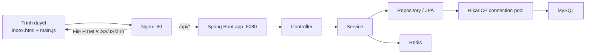

# Cấu trúc chương trình

> Tách từ docs/phan-tich-cau-truc-thuat-toan-cong-nghe.md để dễ đọc và tra cứu theo từng phần.

## 1. Cấu trúc chương trình

### 1.1. Nhìn tổng thể

Project được chia thành bốn phần chạy chính: frontend, Nginx, backend Spring Boot và tầng dữ liệu MySQL/Redis.

```text
PBL3/
├── Front end/                  # Giao diện chạy trên trình duyệt
│   ├── index.html              # Khung HTML chính
│   └── assets/
│       ├── main.js             # Logic giao diện và nghiệp vụ frontend
│       ├── style.css           # CSS chính
│       └── images/             # Ảnh banner và sản phẩm
│
├── backend/                    # REST API Spring Boot
│   ├── pom.xml                 # Dependency Maven
│   ├── Dockerfile              # Build backend thành Docker image
│   └── src/main/
│       ├── java/com/flarefitness/backend/
│       │   ├── config/         # Security, Redis, CORS
│       │   ├── controller/     # Nhận request HTTP
│       │   ├── dto/            # Dữ liệu request/response API
│       │   ├── entity/         # Ánh xạ bảng MySQL
│       │   ├── repository/     # Truy vấn database
│       │   ├── security/       # JWT, token store, rate limit
│       │   └── service/        # Luật nghiệp vụ
│       └── resources/
│           └── application.properties
│
├── db-init/                    # Schema, index, migration và dữ liệu mẫu MySQL
├── nginx/nginx.conf            # Phục vụ frontend và chuyển tiếp API
├── docs/                       # Tài liệu phân tích
├── scripts/                    # Script hỗ trợ dữ liệu/ảnh
├── docker-compose.yml          # Ghép MySQL, Redis, backend và Nginx
├── docker-compose.dev.yml      # Cấu hình bổ sung cho môi trường dev
└── .env.example                # Mẫu biến môi trường
```

Các thư mục như `.git/`, `target/`, `node_modules/`, `output/` hoặc thư mục tạm không chứa nghiệp vụ chính và không cần đọc khi phân tích chương trình.

### 1.2. Tên kiến trúc của chương trình

Tên phù hợp và đầy đủ nhất cho cấu trúc hiện tại là:

> **Kiến trúc nguyên khối phân lớp, triển khai theo mô hình Client-Server 3 tầng**
> Tiếng Anh: **Layered Monolithic Architecture / Three-tier Client-Server Architecture**.

Chương trình có thể được nhìn ở hai mức:

1. Ở mức toàn hệ thống, chương trình sử dụng mô hình Client-Server 3 tầng.
2. Ở bên trong backend Spring Boot, chương trình sử dụng kiến trúc phân lớp và tổ chức package theo tầng kỹ thuật.

#### Ba tầng của toàn hệ thống

| Tầng | Thành phần trong chương trình | Tác dụng |
| --- | --- | --- |
| Presentation | `Front end/` và Nginx | Hiển thị giao diện, nhận thao tác người dùng và chuyển tiếp API. |
| Application/Business | Backend Spring Boot | Xử lý xác thực, sản phẩm, đơn hàng, đánh giá và các luật nghiệp vụ. |
| Data | MySQL và Redis | MySQL lưu dữ liệu lâu dài; Redis lưu cache, JWT, OTP và dữ liệu giới hạn truy cập. |

```text
Người dùng
    ↓
Frontend HTML/CSS/JavaScript
    ↓
Nginx
    ↓
Spring Boot REST API
    ↓
MySQL + Redis
```

#### Vì sao đây là kiến trúc nguyên khối phân lớp?

- Tất cả nghiệp vụ backend nằm trong một ứng dụng Spring Boot và được build thành một file JAR/container `app`.
- Các nghiệp vụ sản phẩm, đơn hàng, đánh giá, tài khoản và hỗ trợ chưa được tách thành các service triển khai độc lập.
- Backend được chia thành các tầng `controller → service → repository → entity/database`.
- Các package được nhóm theo loại kỹ thuật như `controller/`, `service/`, `repository/`. Cách tổ chức này được gọi là **package-by-layer**.

Docker Compose chạy Nginx, backend, MySQL và Redis trong các container riêng, nhưng việc tách container không tự biến chương trình thành microservices. Vì chỉ có một backend xử lý toàn bộ nghiệp vụ, chương trình vẫn là **Layered Monolith được triển khai bằng Docker Compose**.

#### Quan hệ với MVC

Chương trình có áp dụng tư tưởng MVC:

| Thành phần MVC | Thành phần tương ứng |
| --- | --- |
| Model | Entity, Repository và Service |
| Controller | Các class trong package `controller/` |
| View | `Front end/index.html`, CSS và JavaScript |

Tuy nhiên, backend không trực tiếp render View mà trả REST API dạng JSON cho frontend tách biệt. Vì vậy, gọi chương trình là **RESTful Layered Architecture có frontend tách biệt** sẽ chính xác hơn gọi đơn thuần là MVC truyền thống.

### 1.3. Luồng một request trong chương trình

Ví dụ khi người dùng mở trang sản phẩm hoặc gửi đơn hàng:



Ý nghĩa từng bước:

1. Trình duyệt luôn kết nối vào Nginx qua cổng `80`.
2. Nếu request là file giao diện, Nginx đọc trực tiếp từ `Front end/`.
3. Nếu URL bắt đầu bằng `/api/`, Nginx chuyển request sang container backend `app:8080`.
4. Controller nhận HTTP request và chuyển dữ liệu cho service.
5. Service kiểm tra luật nghiệp vụ, có thể đọc Redis hoặc gọi repository.
6. Repository dùng JPA/Hibernate; HikariCP cấp connection đã có sẵn để truy vấn MySQL.
7. Backend trả DTO dạng JSON; frontend nhận JSON và cập nhật giao diện.

### 1.4. Trách nhiệm các tầng backend

```text
HTTP request
   ↓
Controller: nhận URL, body, query parameter và trả HTTP response
   ↓
Service: kiểm tra quyền, trạng thái và luật nghiệp vụ
   ↓
Repository: truy vấn hoặc ghi dữ liệu
   ↓
Entity/MySQL: lưu dữ liệu lâu dài
```

| Tầng | Trách nhiệm | Ví dụ thật trong project |
| --- | --- | --- |
| `controller/` | Định nghĩa endpoint và nhận request. Không nên chứa thuật toán nghiệp vụ dài. | `ProductController`, `OrderController`, `ProductReviewController`. |
| `service/` | Nơi xử lý nghiệp vụ chính. | `OrderService` tạo đơn, lưu snapshot địa chỉ; `ProductReviewService` chặn đánh giá trùng. |
| `repository/` | Khai báo query JPA/JPQL/native SQL. | `ProductRepository` full-text search; `OrderRepository` cursor pagination. |
| `entity/` | Ánh xạ object Java sang bảng/cột MySQL. | `Product` ↔ `tbl_san_pham`, `Order` ↔ `tbl_don_hang`. |
| `dto/` | Quy định dữ liệu được nhận/trả qua API. | `OrderRequest`, `OrderResponse`, `PageResponse`. |
| `security/` | Xác thực và giới hạn truy cập. | `JwtAuthenticationFilter`, `RedisTokenStore`, `IpRateLimitService`. |
| `config/` | Tạo và cấu hình các thành phần dùng chung. | `SecurityConfig`, `RedisConfig`. |

Ví dụ luồng tạo đánh giá:

```text
POST /api/reviews
→ ProductReviewController
→ ProductReviewService.createReview()
→ kiểm tra user, đơn đã giao, sản phẩm thuộc đơn, đánh giá chưa tồn tại
→ ProductReviewRepository.save()
→ tbl_danh_gia_san_pham
```

### 1.5. Frontend

Frontend là website tĩnh, không có framework build riêng. Nginx phục vụ trực tiếp các file trong `Front end/`.

- `Front end/index.html`: chứa cấu trúc màn hình khách hàng, admin và nhân viên.
- `Front end/assets/main.js`: chứa render catalog, tìm kiếm, lọc, giỏ hàng, checkout, địa chỉ, đơn hàng, đánh giá, workspace admin/staff và đồng bộ API/localStorage.
- `Front end/assets/images/`: chứa banner và ảnh sản phẩm.

`main.js` giữ một số dữ liệu trong bộ nhớ trình duyệt để thao tác nhanh, ví dụ `allProducts`, `productById`, giỏ hàng và state giao diện. Dữ liệu quan trọng như tài khoản, sản phẩm, đơn hàng và đánh giá vẫn được backend kiểm tra trước khi ghi MySQL.

### 1.6. Database, Redis và Docker

`docker-compose.yml` tạo bốn service:

| Service | Vai trò | Cách kết nối |
| --- | --- | --- |
| `nginx` | Cổng vào của website, phục vụ frontend và proxy API. | Publish host port `80`. |
| `app` | Backend Spring Boot. | Chỉ mở `8080` trong Docker network. |
| `db` | MySQL lưu dữ liệu lâu dài. | Backend dùng hostname `db:3306`; host local chỉ truy cập qua `127.0.0.1:3307`. |
| `redis` | Lưu dữ liệu tạm thời và cache. | Backend dùng hostname `redis:6379`; không publish ra host/public. |

Dữ liệu MySQL được giữ trong Docker volume `mysql-data`, vì vậy việc rebuild hoặc recreate container không tự xóa database.

Các nhóm bảng quan trọng:

| Nhóm nghiệp vụ | Bảng chính |
| --- | --- |
| Tài khoản và khách hàng | `tbl_nguoi_dung`, `tbl_khach_hang` |
| Sản phẩm và giỏ hàng | `tbl_san_pham`, `tbl_bien_the_san_pham`, `tbl_gio_hang`, `tbl_chi_tiet_gio_hang` |
| Đơn hàng | `tbl_don_hang`, `tbl_chi_tiet_don_hang`, `tbl_thanh_toan` |
| Đánh giá | `tbl_danh_gia_san_pham` |
| Analytics và đề xuất | `tbl_su_kien_hanh_vi_nguoi_dung`, `tbl_ho_so_hanh_vi_nguoi_dung` |
| Đồng bộ và hỗ trợ | `tbl_sync_state`, `tbl_ho_tro_khach_hang`, `tbl_tin_nhan_ho_tro` |

Database local hiện có **93 index duy nhất trên 17 bảng**: 17 primary key, 15 unique index, 1 full-text index và 60 secondary index thông thường. Các index quan trọng được định nghĩa trong `schema_full.sql`, `analytics_schema.sql` và các migration `performance_indexes_patch.sql`, `customer_phone_unique_patch.sql`.
